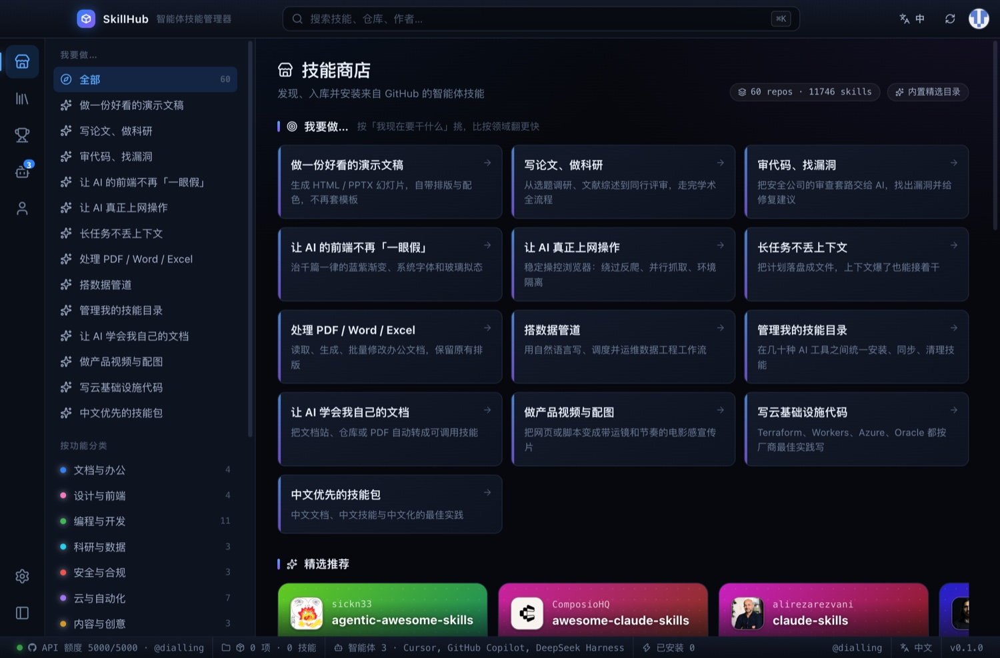
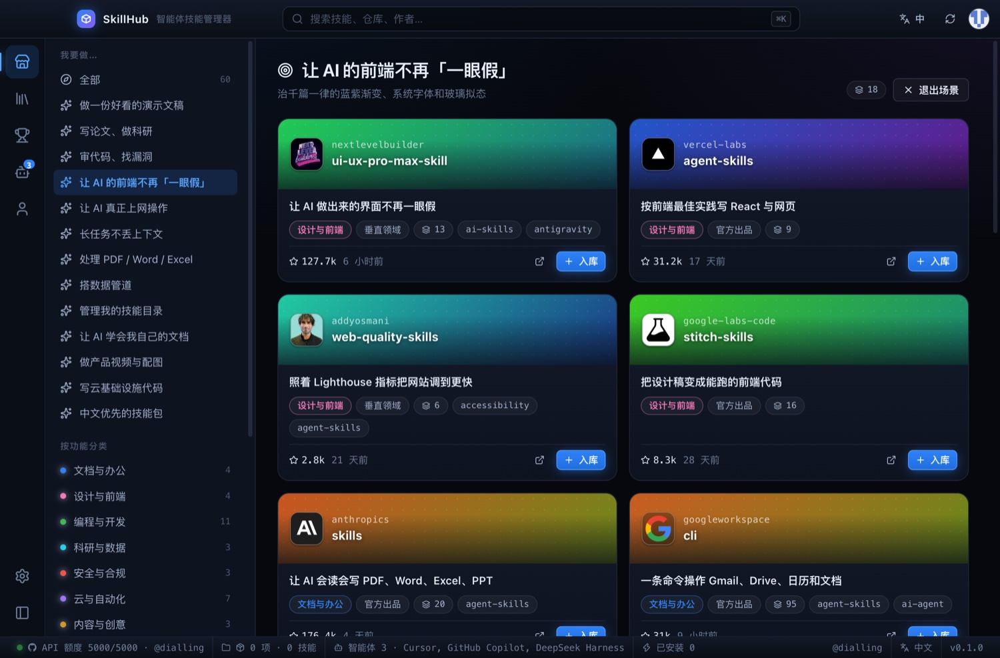
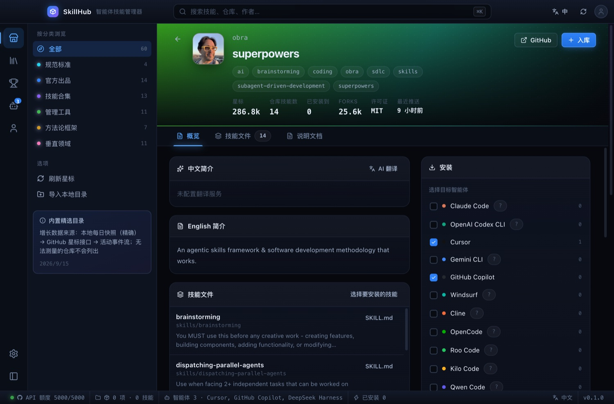
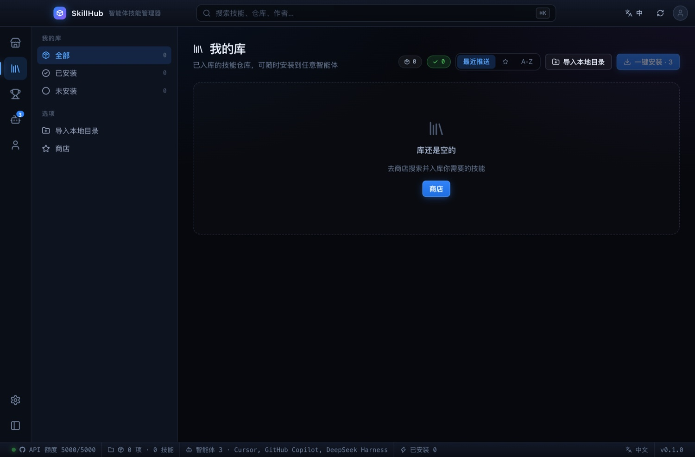
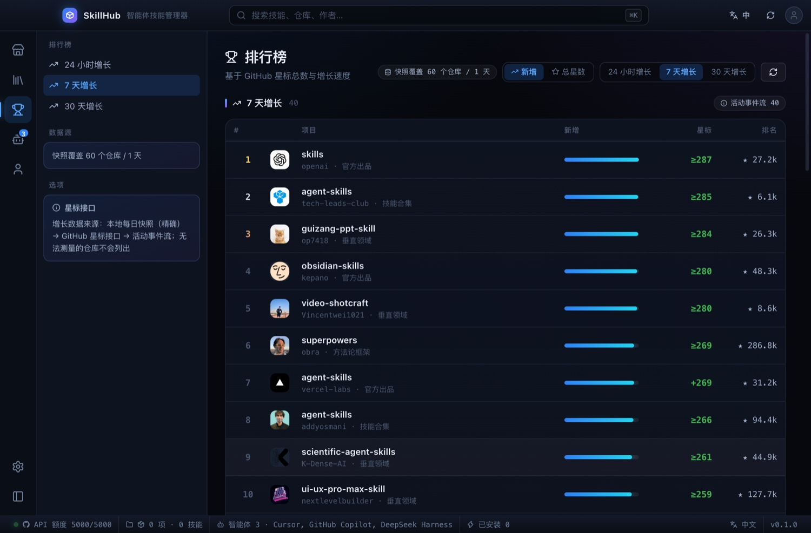
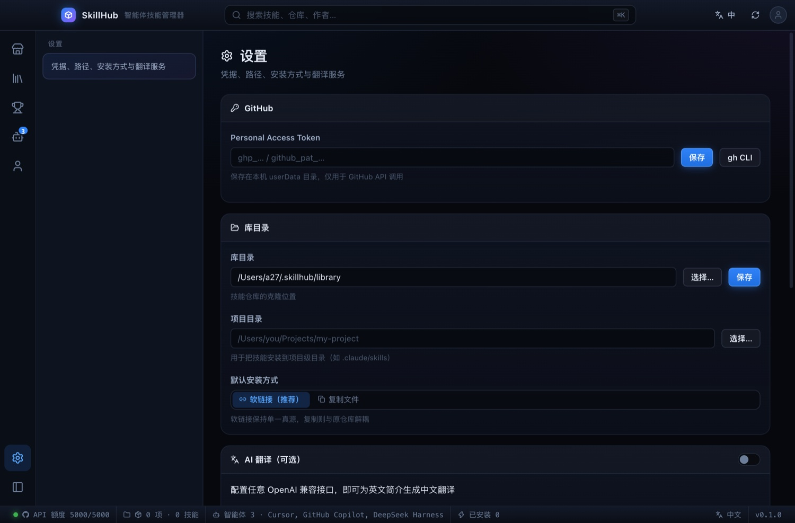
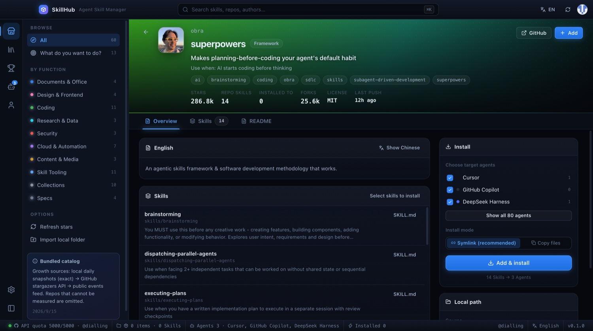

# SkillHub

> 像 Steam 管理游戏一样管理 AI 智能体技能 — 搜索、入库、一键安装到任意 agent。

SkillHub 是一个 macOS 桌面应用（Electron + React），把「登录 GitHub → 搜索技能 → 克隆到本地 → 装进对应 agent 的 skills 目录」这条链路图形化。
界面是 **Steam 的浏览模型**（卡片墙、商店详情页、库、排行榜、个人资料）+ **VSCode 的骨架**（活动栏、侧边栏、命令面板、状态栏）。

## 界面

| 技能商店 | 场景页（「我要做…」） |
|---|---|
|  |  |
| 按功能分类 + 场景入口 + 本周热门（按真实星标增长排序） | 按「我现在要干什么」挑，比翻领域更快 |

| 仓库详情页 | 我的库 |
|---|---|
|  |  |
| 一句话说清做什么、什么时候用、技能清单、右侧一键安装栏 | 已入库仓库，可批量安装到所有已启用 agent |

| 排行榜 | 我的库 |
|---|---|
|  |  |
| 总星数榜与 24h / 7d / 30d 增长榜，每行标注数据来源 | 已入库仓库，可批量安装到所有已启用的 agent |

| 设置 | 英文界面 |
|---|---|
|  |  |
| 已登录时直接显示账号与凭据来源，不再要求输入 Token | 完整双语，切换后界面无一处语言混杂 |

---

## 快速开始

```bash
git clone https://github.com/dialling/skillhub.git
cd skillhub
npm install
npm run build        # 构建 main / preload / renderer
npm run app          # 启动桌面应用
```

开发模式（渲染层热更新）：

```bash
npm run dev
```

> **关于 `ELECTRON_RUN_AS_NODE`**：某些终端环境会全局导出 `ELECTRON_RUN_AS_NODE=1`，而 Electron 只检查该变量
> **是否存在**（空值也算），此时它会以纯 Node 模式启动 —— 表现为 `require('electron')` 返回二进制路径字符串、
> `app` 为 undefined。所有 npm 脚本都通过 `scripts/run.mjs` 显式删除该变量后再启动，`npm run app` 可直接使用。

---

## 功能

### 商店（Discover）

**按功能分类，不按仓库类型分。** 原来的分类（官方 / 合集 / 工具 / 框架）描述的是「这个仓库是什么」，
用户看到的却是「我想做什么」。现在十个功能类目回答后者：

| 文档与办公 | 设计与前端 | 编程与开发 | 科研与数据 | 安全与合规 |
|---|---|---|---|---|
| 云与自动化 | 内容与创意 | 技能管理 | 技能合集 | 规范与标准 |

**场景入口（「我要做…」）** —— 参照 agent skill 目录站的 Popular Scenarios：
不问你属于哪个领域，而问你现在要干什么。13 个场景，如「做一份好看的演示文稿」
「让 AI 的前端不再一眼假」「长任务不丢上下文」「处理 PDF / Word / Excel」，
每个场景给出经过挑选的仓库清单（人工置顶 + 关键词补充）。

**一句话说清做什么。** 商店里每条目都有一行「一眼看懂」的简介，写法有硬性标准：
13–30 字、动词开头、说产出不说身份、禁止实现细节与「技能/工具」自指。
60 条简介的中位字数从 **50 字降到 20 字**，最长的从 89 降到 31。
标准与逐字语料见 [`docs/blurb-formula.md`](docs/blurb-formula.md) 与
[`docs/research/corpus-own.md`](docs/research/corpus-own.md)。

- **内置精选目录**：随应用分发的 **101 个技能仓库，共 9,149 个去重后的技能**，每个仓库都有
  「一眼看懂」的中文简介、英文简介、功能分类、来源标签（官方 / 合集 / 工具）、星数与技能数。

  > **关于技能计数**：原始抓取按「含 SKILL.md 的目录」计数会严重虚高。大型仓库会为不同 agent
  > 把同一批技能重复打包（`sickn33/agentic-awesome-skills` 贡献 6,670 条，实际只有 2,119 个技能），
  > 也有仓库把模板脚手架算进来（`gotalab/cc-sdd` 的 137 条里 136 条在 `templates/` 下，真技能只有 1 个）。
  > 清洗规则同时存在于 `scripts/dedupe-catalog-skills.mjs`（批量）与
  > `src/main/core/skilldirs.ts`（运行时，供详情页计数使用），按目录名去重并剔除脚手架。
- **GitHub 实时搜索**：多个定向查询合并去重（`topic:agent-skills`、`topic:claude-skills`、`SKILL.md in:readme`…），
  而不是把关键词直接丢给 GitHub 的相关性排序。

### 入库（Library）
- 对仓库执行 `git clone --depth 1` 到 `~/.skillhub/library/<owner>__<repo>`。
- 递归扫描整棵目录树，找出**每一个含 `SKILL.md` 的目录**（不只是顶层），解析 YAML frontmatter 得到名称与描述。
- 支持 `git pull` 同步更新、移出库（同时清理本地文件与关联安装）。
- 支持**导入本地目录**：把一个本地技能文件夹直接纳入库。
- 私有仓库：公开克隆失败时自动用已登录凭据重试，成功后把 token 从 `.git/config` 的 remote 里抹掉。

### 一键安装（Install）
- 把库里的技能装进 agent 的 skills 目录，两种方式：
  - **软链接（默认，推荐）**：单一真源，更新库即更新所有 agent；
  - **复制**：与原仓库解耦，副本内写入 `.skillhub-install.json` 标记以便识别与清理。
- **多 agent 适配**：内置 80 个 agent 的技能目录注册表（见下），自动探测本机装了哪些，默认勾选已启用的。
  安装栏默认只列出已启用的 agent，其余通过「显示全部」展开并支持搜索。
- 命名冲突处理：目标已存在且不是 SkillHub 管理的，自动追加 owner 后缀；仍是冲突就跳过并如实报告，绝不覆盖别人的东西。
- 多个 agent 共享同一物理目录时（例如 Zed / Goose / `.agents` 标准都读 `~/.agents/skills`），只做一次文件操作，但为每个 agent 保留安装记录。

### 排行榜（Charts）
- **总星数榜** 与 **增长榜（24 小时 / 7 天 / 30 天）**。
- GitHub 没有星标历史接口，所以 SkillHub 按可靠性依次尝试三种数据源，并在每一行标注来源：
  1. **本地每日快照**（最精确，免费）— 应用每天记录一次星数，累积几天后增长数据完全精确；
  2. **星标接口** `/repos/{o}/{r}/stargazers`（`star+json`，二分查找定位日期边界，结果精确）；
  3. **活动事件流** `/repos/{o}/{r}/events` 中的 `WatchEvent`（真实数据；热门仓库的事件流有上限，此时显示 `≥` 表示下界）。
- **无法测量的仓库不会以「+0」假装有数据**，而是直接不列出。

### 个人资料（Profile）
- GitHub 登录（Personal Access Token 或直接复用 `gh` CLI 凭据），显示头像、昵称、仓库数、关注者。
- 本地统计：入库仓库数、已安装技能数、启用 agent 数、占用空间。
- 最近活动时间线、我的 Star 列表。

### 智能体（Agents）
- **80 个 agent** 的技能目录注册表（`data/agent-registry.json`），每条都带 `confidence` 与 `sourceUrl`，
  UI 上可直接点开查看依据；非高置信度的条目会显示置信度角标。
- **按厂商分组**：同一家公司的 agent 归在一起（Moonshot AI 下面是 Kimi Code CLI 与 Kimi CLI，
  Alibaba 下面是 Qwen Code / Qoder / 灵码…），已经装了的厂商排在前面。
- 支持搜索（匹配名称、厂商或路径 —— 搜 `kimi` 找 agent，搜 `moonshot` 找厂商）
  与 全部 / 已检测 / 已启用 分段视图。
- 检测同时看目录、配置文件与命令行；若某个二进制位于**另一个** agent 的目录内（例如 Kimi CLI 与
  Kimi Code 的二进制都叫 `kimi`），则不计入该 agent 的证据，避免误报。
- 只记录项目级目录的 agent（如 ona / qodo / replit）也会列出，安装到「设置」里配置的项目目录。
- 展示每个目录里已有的技能、哪些是 SkillHub 装的（软链接指向库 / 含标记文件）、哪些没有 `SKILL.md`。
- 支持自定义目录（例如你自己的 agent）。

<!-- AGENT-TABLE:START -->
共 **80** 个 agent。

| Agent | 全局技能目录 | 项目级目录 |
|---|---|---|
| Claude Code | `~/.claude/skills` | `.claude/skills` |
| OpenAI Codex CLI | `~/.codex/skills` | `.codex/skills` ·ᵁ |
| Cursor | `~/.cursor/skills` | `.cursor/skills` ·ᵁ |
| Gemini CLI | `~/.gemini/skills` | `.gemini/skills` ·ᵁ |
| GitHub Copilot | `~/.copilot/skills` | `.github/skills` ·ᵁ |
| Kimi Code CLI | `~/.kimi-code/skills` | `.kimi-code/skills` ·ᵁ |
| Kimi CLI | `~/.kimi/skills` | `.kimi/skills` ·ᵁ |
| Windsurf | `~/.codeium/windsurf/skills` | `.windsurf/skills` ·ᵁ |
| Cline | `~/.cline/skills` | `.cline/skills` |
| Qwen Code | `~/.qwen/skills` | `.qwen/skills` ·ᵁ |
| Roo Code | `~/.roo/skills` | `.roo/skills` ·ᵁ |
| Kilo Code | `~/.kilo/skills` | `.kilo/skills` ·ᵁ |
| OpenCode | `~/.config/opencode/skills` | `.opencode/skills` ·ᵁ |
| Trae | `~/.trae/skills` | `.trae/skills` ·ᵁ |
| Kiro | `~/.kiro/skills` | `.kiro/skills` |
| Amp | `~/.config/agents/skills` | `.agents/skills` ·ᵁ |
| Goose | `~/.agents/skills` | `.agents/skills` ·ᵁ |
| Continue ᵐ | `~/.continue/skills` | `.continue/skills` |
| Zed | `~/.agents/skills` | `.agents/skills` ·ᵁ |
| Warp | `~/.warp/skills` | `.warp/skills` ·ᵁ |
| Factory Droid | `~/.factory/skills` | `.factory/skills` ·ᵁ |
| DeepSeek Harness | `~/.dsh/skills` | `.dsh/skills` ·ᵁ |
| Agent Skills portable .agents convention | `~/.agents/skills` | `.agents/skills` ·ᵁ |
| Tongyi Lingma (Qoder CN IDE) | `~/.lingma/skills` | `.lingma/skills` |
| Qoder | `~/.qoder/skills` | `.qoder/skills` |
| CodeBuddy Code | `~/.codebuddy/skills` | `.codebuddy/skills` |
| Comate (Wenxin Kuaixiang) | `~/.comate/skills` | `.comate/skills` ·ᵁ |
| Qoder CN CLI | `~/.qoder-cn/skills` | `.qoder/skills` |
| Huawei CodeArts Agent (CodeArts Doer / Snap) | `~/.codeartsdoer/skills` | `.codeartsdoer/skills` |
| MiniMax Code | `~/.minimax/skills` | `.minimax/skills` ·ᵁ |
| WorkBuddy ᵐ | `~/.workbuddy/skills` | `.workbuddy/skills` |
| Neovate | `~/.neovate/skills` | `.neovate/skills` |
| Pochi | `~/.pochi/skills` | `.pochi/skills` ·ᵁ |
| CodeRider | `~/.coderider/skills` | `.coderider/skills` |
| iFlow CLI | `~/.iflow/skills` | `.iflow/skills` |
| ZCode | `~/.zcode/skills` | `.zcode/skills` ·ᵁ |
| CoStrict | `~/.costrict/skills` | `.costrict/skills` ·ᵁ |
| JoyCode ᵐ | `~/.joycode/skills` | `.joycode/skills` |
| QoderWork | `~/.qoderwork/skills` | — |
| Deep Code | `~/.deepcode/skills` | `.deepcode/skills` ·ᵁ |
| DeepSeek-TUI ᵐ | `~/.deepseek/skills` | `.deepseek/skills` |
| Kode CLI | `~/.kode/skills` | `.kode/skills` |
| Junie | `~/.junie/skills` | `.junie/skills` ·ᵁ |
| Augment Code | `~/.augment/skills` | `.augment/skills` ·ᵁ |
| Google Antigravity | `~/.gemini/config/skills` | `.agents/skills` ·ᵁ |
| Grok Build / xAI Grok CLI | `~/.grok/skills` | `.grok/skills` ·ᵁ |
| Devin CLI (Devin for Terminal) | `~/.config/devin/skills` | `.devin/skills` ·ᵁ |
| OpenHands | `~/.agents/skills` | `.agents/skills` ·ᵁ |
| Tabnine CLI | `~/.tabnine/agent/skills` | `.tabnine/agent/skills` ·ᵁ |
| Rovo Dev CLI | `~/.rovodev/skills` | `.rovodev/skills` ·ᵁ |
| Mistral Vibe | `~/.vibe/skills` | `.vibe/skills` ·ᵁ |
| Crush | `~/.config/crush/skills` | `.crush/skills` |
| Letta Code | `~/.letta/skills` | `.agents/skills` ·ᵁ |
| AiderDesk | `~/.aider-desk/skills` | `.aider-desk/skills` |
| OpenClaw | `~/.openclaw/skills` | `.agents/skills` ·ᵁ |
| Hermes Agent | `~/.hermes/skills` | `.hermes/skills` ·ᵁ |
| Mux / Xum | `~/.xum/skills` | `.xum/skills` ·ᵁ |
| Firebender | `~/.firebender/skills` | `.firebender/skills` ·ᵁ |
| Ona | — | `.ona/skills` ·ᵁ |
| Qodo | — | `.qodo/skills` ·ᵁ |
| Snowflake Cortex Code | `~/.snowflake/cortex/skills` | `.cortex/skills` |
| Command Code | `~/.commandcode/skills` | `.commandcode/skills` ·ᵁ |
| pi coding agent | `~/.pi/agent/skills` | `.pi/skills` ·ᵁ |
| Autohand Code CLI | `~/.autohand/skills` | `.autohand/skills` |
| Emdash | `~/.agentskills` | — |
| fast-agent | — | `.fast-agent/skills` ·ᵁ |
| nanobot | `~/.nanobot/workspace/skills` | — |
| VT Code ᵐ | `~/.agents/skills` | `.agents/skills` ·ᵁ |
| Bub ᵐ | `~/.agents/skills` | `.agents/skills` ·ᵁ |
| Sarvam Code ᵐ | `~/.agents/skills` | `.agents/skills` ·ᵁ |
| Zencoder ᵐ | `~/.zencoder/skills` | `.zencoder/skills` |
| Zenflow ᵐ | `~/.zencoder/skills` | `.zencoder/skills` |
| Deep Agents ᵐ | `~/.deepagents/agent/skills` | `.agents/skills` ·ᵁ |
| IBM Bob ᵐ | `~/.bob/skills` | `.bob/skills` |
| Posit Assistant ᵐ | `~/.posit/assistant/skills` | `.posit/assistant/skills` |
| Replit Agent | — | `.agents/skills` ·ᵁ |
| AdaL ᵐ | `~/.adal/skills` | `.adal/skills` |
| ForgeCode ᵐ | `~/.forge/skills` | `.forge/skills` |
| Kimchi ᵐ | `~/.config/kimchi/harness/skills` | `.kimchi/skills` |
| Dexto ᵐ | `~/.agents/skills` | `.agents/skills` ·ᵁ |

> `ᵁ` = 同时读取通用目录 `~/.agents/skills`；`ᵐ` / `ˡ` = 中等 / 低置信度，
> 表示该路径来自厂商源码或未能从官方文档核实，可在应用内「智能体」页点开查看出处。

*由 `scripts/update-readme-agents.mjs` 从 `data/agent-registry.json` 生成，请勿手改。*
<!-- AGENT-TABLE:END -->

### 界面配色
八套**完整配色**，设置里一键切换。每套换的是整套色板 —— 背景层级、面板、边框、
文字四级灰阶、浮层底色、光晕与强调色一起变，不是只换一个高亮色：

| 深色（6 套） | 浅色（2 套） |
|---|---|
| 深空蓝 · 纯黑 OLED · 石墨灰 · 深林绿 · 午夜紫 · 暖褐 | 亮色·日光 · 亮色·纸张 |

其中「纯黑 OLED」是真正的 `#000` 底，「暖褐」和「亮色·纸张」带暖色调，
「亮色·日光」是标准浅色 —— 切换后是完全不同的观感，不只是强调色变了。

实现：主题就是往 `:root` 写一组 CSS 自定义属性（`--bg-0..5` / `--text-0..3` /
`--border-rgb` / `--tint-rgb` / `--shadow-rgb` / `--glass-rgb` / `--field-rgb` /
`--scrim-rgb` / `--accent*` / `--ambient-*`），
组件完全不需要知道「主题」这个概念。为此把 CSS 里 70 处硬编码颜色全部参数化，
并区分了「叠加色」（`--tint-rgb`：深色主题是白，浅色主题是深色）与
「阴影色」（`--shadow-rgb`），否则浅色主题不可能成立。
另外会同步 `documentElement.dataset.scheme` 与 `color-scheme`，
让滚动条等原生控件也跟着切换。

### 顶部图标
标题栏左侧用的是 Electron 风格的原子图标（浅色圆角底板 + 深色圆盘 + 三条轨道 + 中心核）。
原始素材是位图、无法换色，所以按同样的几何重绘成了矢量，由 CSS 变量驱动：

| 部位 | 变量 |
|---|---|
| 圆角底板 | `--text-0` |
| 内部圆盘 | `--bg-0` |
| 轨道、电子、中心核 | `--accent-hi` |

因此它会随配色实时变化 —— 深空蓝下是蓝轨道、深林绿下是绿轨道、午夜紫下是紫轨道；
在两套亮色主题下底板与圆盘会自动反转（深底板 + 浅圆盘），
否则白色底板在浅色标题栏上会直接消失。

### 本机技能发现
应用会扫描所有智能体的技能目录，把**已经装在你电脑上**的技能找出来，并匹配回商店里的来源：

- 库页面顶部显示「本机已发现 N 个技能」，其中能在商店找到来源的直接给出「入库来源」按钮 ——
  下次要用这个技能，从库里选就行，不用再去搜索
- 匹配按技能目录名，并处理了两种容易出错的情况：
  技能位于仓库根目录时（目录记为 `.`）要用仓库名匹配；智能体目录里混着的索引文件
  （如 WorkBuddy 的 `_bm_skillid_migration.json`）不是技能，会被过滤
- 多个智能体共享同一物理目录时只报告一次

### 技能安装位置
从商店安装的技能需要一个落地目录，智能体从这里读取。应用会自动决定并说明理由：

1. 你已经指定过的位置
2. 已经在用、且技能最多的那个智能体目录（沿用你的习惯）
3. 通用目录 `~/.agents/skills` —— 多数智能体都会读取，兼容性最好
4. 电脑上还没有任何技能目录时，新建通用目录，而不是猜一个厂商目录

**首次入库时会弹出提示**，展示推荐位置、推荐理由，以及所有已存在目录的清单
（含各自已有多少技能）供你改选，也可以手填路径。事后随时可在「设置 → 技能安装位置」更改。

### 界面细节
- **文字可框选复制**：技能简介、agent 路径、错误信息等都能直接选中复制，
  并且鼠标移到这些文本上会变成文本光标，先告诉你「这里能选」；
  只有按钮、标签、导航这类控件不参与选择，避免拖拽时误选。
- **刷新动画**：标题栏的刷新按钮在请求进行期间持续旋转并禁用，完成才恢复。
- **可收起的侧边栏**：活动栏底部（左下角）的按钮收起/展开，状态会记住（下次启动保持原样）。
  侧边栏只放「当前页面能做的选择」——例如商店里只保留「全部 / 我要做…」两个入口加功能分类，
  13 个场景在内容区以卡片挑选。
- **命令面板**：`⌘K` / `⌘P`，可跳转页面、切换语言、刷新，或直接搜索库/精选目录/GitHub。
- **状态栏**：GitHub 连接状态与账号、库统计、已启用 agent、已安装数、语言、版本。
  API 额度不再常驻显示 —— 它几乎永远是 5000/5000，纯属噪声；鼠标悬停可看具体数字，
  只在剩余低于 15% 时才自动冒出一条黄色提醒。
- **完整中英双语**：标题栏、状态栏或设置页一键切换，**原生应用菜单也会跟着重建**。
  简介、标签、按钮、提示、活动日志全部双语，仓库数据（tagline / useWhen）也都有中英两份。
  默认不混杂：英文模式下不出现中文，中文模式下不出现英文（品牌与 agent 专有名词除外）；
  另一种语言的简介折叠在「Show Chinese / 中文原文」按钮后面，需要时才展开。
  完整性由 `npm run i18n` 强制校验，作为构建门禁。
- **实时进度**：克隆、同步、安装都有底部进度条与逐条进度事件。

---

## 命令行（同一套核心）

桌面应用和 CLI 共用同一个状态目录 `~/.skillhub/state`，所以两边看到的库、安装记录完全一致。

```bash
node out/main/cli.js doctor                          # 环境自检
node out/main/cli.js search "pdf document"           # 搜索
node out/main/cli.js add obra/superpowers            # 入库
node out/main/cli.js list                            # 库内容
node out/main/cli.js agents                          # agent 与目录
node out/main/cli.js install --all --agents dsh      # 一键安装全部技能到 DSH
node out/main/cli.js install "obra/superpowers::skills/brainstorming" --agents cursor --copy
node out/main/cli.js installed                       # 已安装技能
node out/main/cli.js uninstall "obra/superpowers::skills/brainstorming"
node out/main/cli.js growth 7                        # 7 天增长榜
```

---

## 自检

```bash
npm run verify     # 类型检查 + 双语审计 + 构建 + 端到端自检，一条命令全跑
npm run selftest   # 只跑端到端自检
npm run i18n       # 只跑双语审计
```

会真实跑完 29 项检查：GitHub 凭据 → 精选目录 → 搜索 → 技能树 → 增长数据源 → 排行榜 →
`git clone` 入库 → 解析出本地 SKILL.md → 软链接安装到临时 agent 目录 → 透过链接读 SKILL.md →
复制模式（含标记文件）→ 卸载 → 清理。全程使用临时目录，不碰你真实的 agent 目录。

---

## 架构

```
src/
  shared/types.ts         主进程 / 渲染进程共用的类型契约
  main/
    index.ts              窗口、菜单、每日星标快照、raw 主机探测
    ipc.ts                全部 IPC handler（统一 { ok, data } 信封）
    cli.ts                命令行入口
    selftest.ts           端到端自检
    core/
      paths.ts            路径解析（含 Electron 不可用时的降级）
      store.ts            无依赖 JSON 存储：原子写入 + 防抖落盘
      db.ts               集合定义：settings / library / installs / stars / activity / cache
      github.ts           API 客户端、搜索、技能树、星标增长多源计算
      agents.ts           agent 注册表、探测、目录扫描
      library.ts          克隆 / 同步 / 移除 / 目录导入
      skills.ts           SKILL.md 解析、递归技能发现
      installer.ts        安装引擎（软链接 / 复制、冲突处理、共享目录去重）
      catalog.ts          精选目录加载与星标刷新
      leaderboard.ts      排行榜（快照优先，API 兜底）
      translate.ts        可选 AI 翻译（任意 OpenAI 兼容接口）
  preload/index.ts        contextBridge API
  renderer/src/           React 界面
data/
  curated-catalog.json    精选技能仓库（含功能分类、中英双语「一眼看懂」简介）
  scenarios.json          13 个场景（「我要做…」）及其推荐仓库
  agent-registry.json     80 个 agent 的技能目录（含出处与置信度）
```

### 存储位置

| 内容 | 路径 |
|---|---|
| 库（git 克隆） | `~/.skillhub/library/` |
| 应用状态（设置、库记录、安装记录、星标历史） | `~/.skillhub/state/` |
| Electron 缓存 | `~/Library/Application Support/skillhub/` |

状态用一个无依赖的 JSON 存储（原子写入 + 防抖），而不是原生 SQLite —— 数据量只有几千条记录，
而 `better-sqlite3` 需要按 Electron ABI 重新编译，代价大于收益。

---

## 开发辅助参数

```bash
```bash
# 直接打开某个页面 / 仓库 / 搜索词
node scripts/run.mjs --electron . --view=charts
node scripts/run.mjs --electron . --repo=obra/superpowers
node scripts/run.mjs --electron . --q="pdf"

# 渲染窗口并写出 PNG 后退出（用于无头验证界面）
node scripts/run.mjs --electron . --view=agents --shot=/tmp/agents.png --shot-delay=8000

# 打印每个阶段的耗时
SKILLHUB_TRACE=1 node scripts/run.mjs --electron . --repo=obra/superpowers
```

---

## 双语审计

`scripts/i18n-audit.mjs` 是双语完整性的强制门禁，检查四件事：

| 检查 | 含义 |
|---|---|
| 缺失词条 | 代码里 `t('some.key')` 在字典里不存在 → 界面会直接显示 `some.key` |
| 渲染层硬编码 | 渲染代码里的中文字面量 → 英文模式下会显示中文 |
| 主进程硬编码 | 经 IPC 传给界面的中文消息 → 同上（终端工具 `cli.ts` / `selftest.ts` 与字典文件已排除） |
| 未翻译词条 | 中英两个值完全相同且含字母 → 中文模式下会显示英文 |

审计会剥离注释后再扫描，因此中文注释不会被误报；`*Zh` 这类成对的数据字段
（例如 `descriptionZh` 配 `descriptionEn`）被视为内容而非界面文案，不计入。

## 已知限制

- **翻译**：中文简介对内置精选目录是预先写好的；对搜索到的新仓库，需要在
  「设置 → AI 翻译」里填一个 OpenAI 兼容接口（如 DeepSeek）才能点「AI 翻译」。未配置时该面板如实提示。
- **增长榜的 `≥`**：热门仓库的事件流只有最近约 300 条，`≥` 表示这是下界。累积几天本地快照后会自动变成精确值。
- **打包分发**：目前是 `npm run app` 直接跑源码；还没接 electron-builder 出 `.dmg`。
- **agent 目录**：注册表基于厂商文档/源码核实，但仍可能随 agent 版本变化；
  非高置信度条目在 UI 上会标出，也可以用「添加自定义目录」覆盖。
